# 🛰️ HomeLab Monitor

[](https://github.com/SikamikanikoBG/homelab-monitor/stargazers)
[](https://github.com/SikamikanikoBG/homelab-monitor/network/members)
[](https://github.com/SikamikanikoBG/homelab-monitor)
[](https://github.com/SikamikanikoBG/homelab-monitor)

[](https://sikamikanikobg.github.io/homelab-monitor/)
[](https://github.com/SikamikanikoBG/homelab-monitor/blob/main/CHANGELOG.md)


[](https://github.com/SikamikanikoBG/homelab-monitor/commits/main)

**One self-hosted page for your whole home lab & AI/GPU rig** — GPU, containers, services and disks, across every machine. No agents, no Prometheus/Grafana, no cloud.

<a href="https://github.com/SikamikanikoBG/homelab-monitor/raw/main/docs/demo.mp4">
  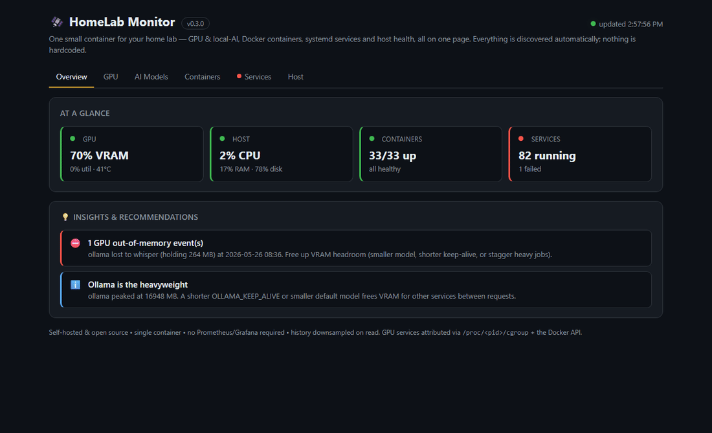
</a>

<sub>▶ <a href="https://github.com/SikamikanikoBG/homelab-monitor/raw/main/docs/demo.mp4"><b>Watch the full HD demo (MP4, ~65s)</b></a> — the GIF above is a muted preview.</sub>

Your home lab grew into a couple of machines, a Pi, and a GPU that's mysteriously always busy. HomeLab Monitor gives you one self-hosted page that answers the real questions: **which model is holding the GPU, which container is eating RAM, what's filling your disks** (WizTree-style treemaps), and **is anything down** — across every box over SSH: Linux, a Pi, even Windows. Readable from your phone over the VPN.

## Get started

```bash
# Grab the compose file and go. No GPU required — GPU panels just light up when one's present.
curl -fsSLO https://raw.githubusercontent.com/SikamikanikoBG/homelab-monitor/main/docker-compose.yml
docker compose up -d
```

Open `http://<your-host>:9800` and you're done. ([from source, GPU toolkit, or Windows ↓](#install-options))

> 🆕 **v0.13.0** — **Windows hosts**, a **RAM vs VRAM** split for containers, and **WizTree-style treemaps** for RAM (by container *and* service) and disk usage, plus a redesigned Hosts onboarding. [Release notes](https://github.com/SikamikanikoBG/homelab-monitor/releases) · [changelog](CHANGELOG.md).

## Screenshots

> The 65-second [demo video](https://github.com/SikamikanikoBG/homelab-monitor/raw/main/docs/demo.mp4) above tours all of this — here are a few stills.

**Overview** — every registered host at a glance, polling every 10 s:

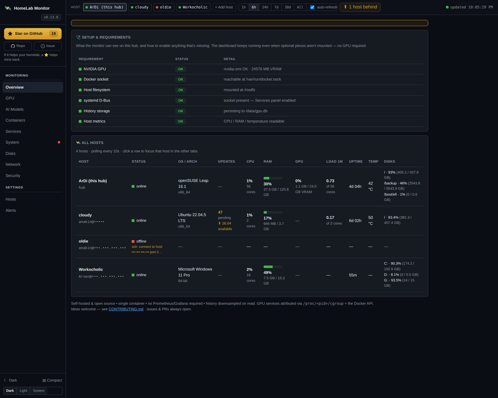

**Memory map & Disks** — interactive treemaps of what's using your RAM (by container *and* service) and your disk space (WizTree-style, click to drill in):

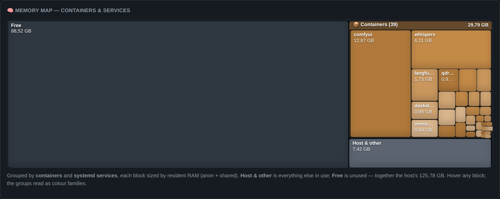
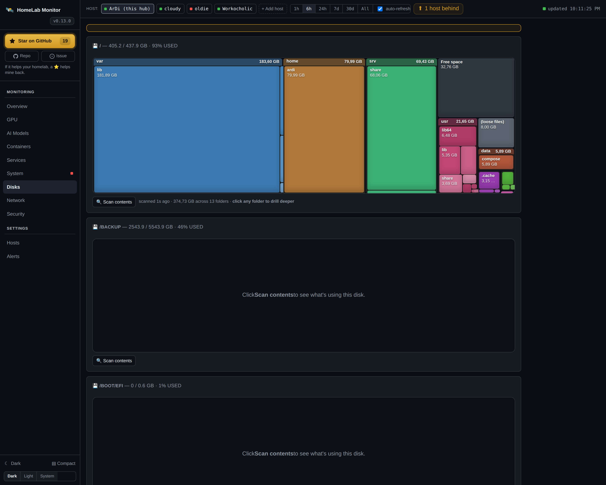

<details>
<summary><b>📸 More screenshots</b> — GPU · Containers (RAM/VRAM) · Services · System · Network · Security · Hosts</summary>

<br>

**GPU** — VRAM by service over time (who held the card, and when):
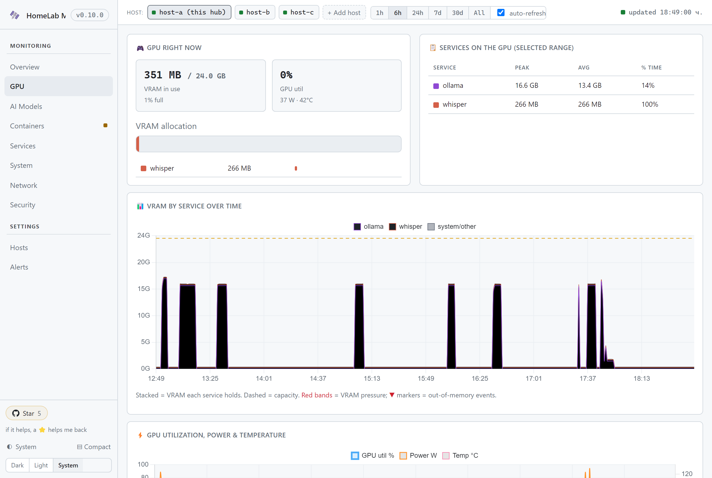

**Containers** — health, **RAM and VRAM in separate columns**, real disk footprint and a table total:
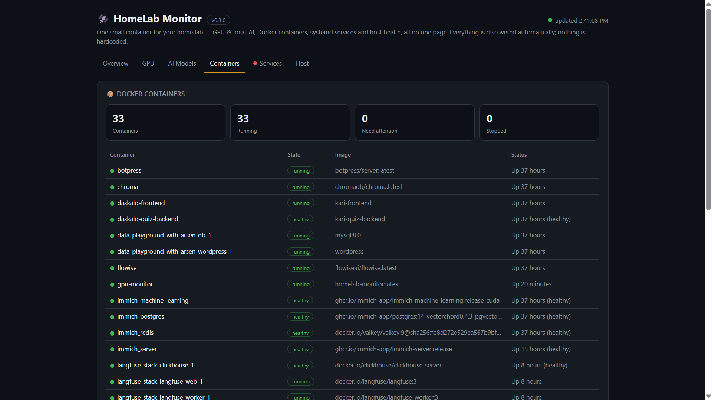

**Services** — systemd health for any host, your own units highlighted and failures first:
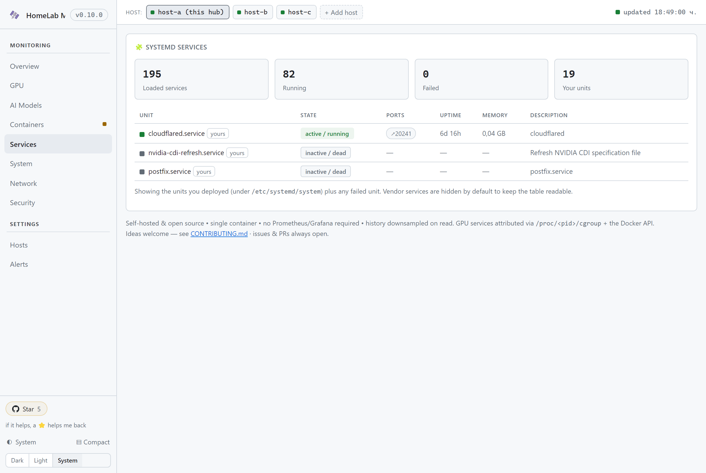

**System** — KPIs + disks + the OS / architecture / hardware inventory:
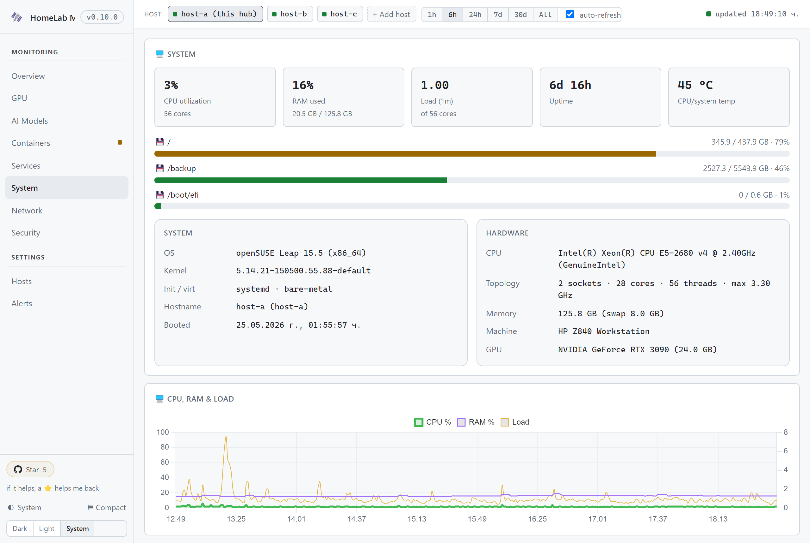

**Network** — interfaces, DNS, and listening sockets with exposure flags:
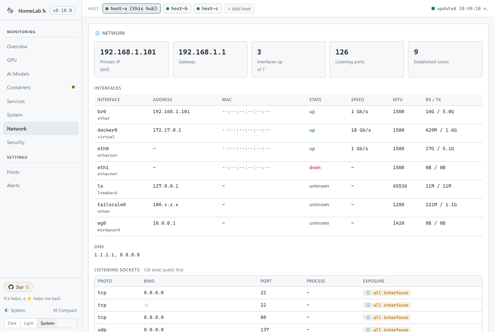

**Security** — firewall, SSH hardening, fail2ban, reboot & updates — issues first:
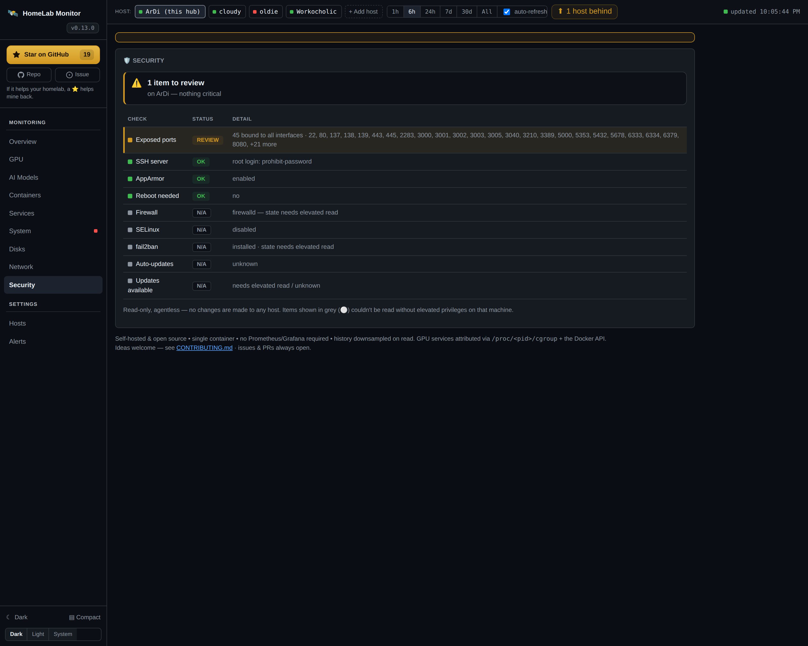

**Hosts** — registry + three-step onboarding with the per-capability checklist:
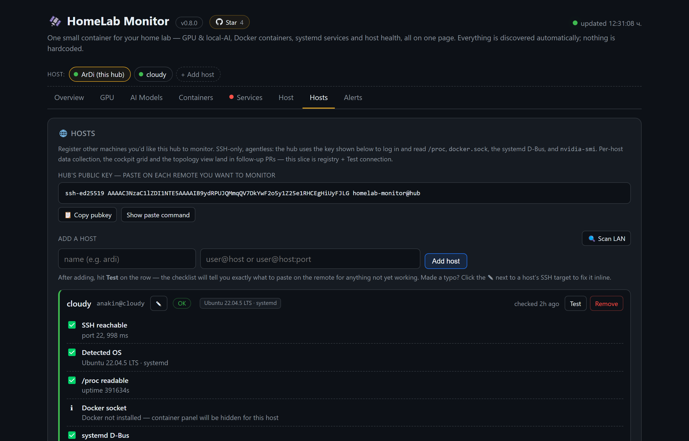

</details>

## What it shows

A **host pill bar** switches between the local box and any registered remote; every tab scopes to the active host.

- **Overview** — every host side by side: CPU, RAM, GPU/VRAM, load, uptime, temp, disks. Click a row to focus it.
- **GPU** — live VRAM / util / power / temp, and *which container holds the VRAM* (auto-mapped), over time.
- **AI Models** — every recognised model server (Ollama, vLLM, llama.cpp, ComfyUI, faster-whisper, …), which model is loaded and its VRAM, plus a **"Driven by"** breakdown of who's calling it.
- **Containers** — health, **RAM vs VRAM in separate columns** (real resident RAM, not page cache), disk footprint, a table total, and clickable port chips.
- **Services** — systemd health (local *or* remote): your units highlighted, failures first, with ports and memory.
- **System** — CPU/RAM/load/temp + a full OS & hardware inventory, **plus a Memory-map treemap** of RAM by container *and* service (works on Docker-less boxes too).
- **Disks** — **WizTree-style** nested folder treemaps: scan a filesystem, drill into folders, find the space hogs.
- **Network** — interfaces, DNS, gateway, and listening sockets flagged by exposure.
- **Security** — firewall, SSH hardening, SELinux/AppArmor, fail2ban, reboot & updates — issues first.
- **Hosts** — three-step onboarding (Linux, a Pi, or **Windows**), a per-capability Test, and the exact per-OS fix command you can run on the remote in place.

History lives in SQLite and is **downsampled on read**, so a six-month view loads as fast as the last hour.

## Multi-machine monitoring

Since 0.8 the hub watches more than its own box. **Open the Hosts tab**, paste
the hub's auto-generated SSH key onto each remote you want to monitor, and the
hub will start polling it. No agents, no installs, just SSH + Python 3.

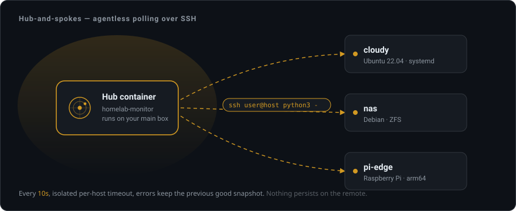

**Adding a host (4 steps, no guessing):**

1. Open **Hosts** → click **🔍 Scan LAN** to suggest reachable boxes (ARP cache
   + TCP-22 sweep), or type a host directly as `user@host[:port]`.
2. Hit **Add host**, then **Test**. The wizard runs a capability checklist:
   - ✅ SSH reachable (port + ms)
   - ✅ Detected OS (e.g. `Ubuntu 22.04.5 LTS · systemd`)
   - ✅ `/proc` readable
   - ⚠️ Docker socket — if `'arsen' not in the docker group`, the exact
     remediation appears inline: `sudo usermod -aG docker arsen`.
   - ✅ systemd D-Bus
   - ℹ️ `nvidia-smi` (or "not found — GPU panel will be hidden")
3. For amber/red rows, click **📋 Copy** or **▶ Run on remote** — if the
   command needs `sudo`, the panel asks for the sudo password with a clear
   *"used once, not stored, never in argv"* note. Output streams back inline.
4. Done — the hub starts polling. Switch to **Overview** to see the new row
   populate within one poll cycle (~10 s).

**Where data comes from.** The hub pipes a small self-contained `probe.py`
through SSH (`ssh user@host python3 -`). Nothing persists on the remote;
the script reads `/proc/*`, `/sys/*` and a handful of config files (for the
OS / hardware / network / security inventory), optionally runs `nvidia-smi`
and `systemctl list-units`, and prints one JSON blob back. It's pure-stdlib
Python 3.6+ and degrades field-by-field, so it runs the same on x86_64, arm64
and i686. The image installs
`openssh-client` and `ssh-keygen` for this — the SSH key lives under
`./data/.ssh/` so it survives rebuilds.

**Windows hosts.** A registered host can be **Windows**, not just Linux. When the
hub detects a Windows remote it pipes a PowerShell probe (`probe.ps1`) instead of
`probe.py` — over the same SSH key, with nothing to install: PowerShell and WMI
are already on every Windows 10/11 / Server box, the way Python 3 is on Linux.
You get the same fleet row plus the **System** (CPU/RAM/disk/hardware),
**Network** (NICs, listening ports, DNS, gateway) and **Services** (Windows
services) tabs, and the **GPU** tab too when `nvidia-smi` is on the host. To add
one: enable the built-in OpenSSH Server on the Windows box
(`Add-WindowsCapability -Online -Name OpenSSH.Server~~~~0.0.1.0`, then
`Start-Service sshd`), drop the hub's key into the user's
`~/.ssh/authorized_keys` (admins use `%ProgramData%\ssh\administrators_authorized_keys`),
and add it on the **Hosts** tab as `user@windows-host`. SELinux/AppArmor,
load-average and systemd rows are simply omitted — they have no Windows analogue.

**Security.** Pubkey auth only (passwords disabled). Per-host SSH timeouts so
a slow remote can never block the loop. The "Run on remote" sudo password is
piped via stdin to the remote `sudo -S` — never appears in argv on either side
and is never persisted to SQLite or logs.

**What this slice covers vs. what's coming:** Overview, System, Network,
Security and Services tabs work for any registered host that supports them.
GPU / AI Models / Containers tabs are local-only for now and tell you exactly why ("cloudy has
no NVIDIA GPU", "Docker not installed on cloudy", etc.) using the host's
capability check — per-host versions land in subsequent releases. See
[#35](https://github.com/SikamikanikoBG/homelab-monitor/issues/35) for the
broader design and follow-up slices.

## Install options

**Only requirement: Docker.** No GPU needed — it auto-detects one and lights up the GPU panels when present; everything else works without. The **Setup & requirements** panel (on Overview) shows what's detected and the one-line command to enable anything missing — e.g. the [NVIDIA Container Toolkit](https://docs.nvidia.com/datacenter/cloud-native/container-toolkit/latest/install-guide.html) for the GPU panels. Nothing fails silently; the container starts even when a piece is missing.

The [**Get started**](#get-started) command above pulls the multi-arch image (`amd64` + `arm64`) from [`sikamikaniko123/homelab-monitor`](https://hub.docker.com/r/sikamikaniko123/homelab-monitor). Upgrade later with `docker compose pull && docker compose up -d`.

**From source** — handy if you're tweaking the code:

```bash
git clone https://github.com/SikamikanikoBG/homelab-monitor.git
cd homelab-monitor && docker compose up -d --build
```

<details>
<summary><b>Running on Windows</b> (WSL2 — no Docker Desktop required)</summary>

<br>

The dashboard is a Linux container, but it runs happily on **Windows 10/11**
through **WSL2** — and you don't need the heavyweight Docker Desktop. Install
the Docker Engine straight into a WSL distro instead:

```powershell
# In PowerShell — install WSL2 if you don't have it yet (one-time, reboot if asked):
wsl --install
```

```bash
# Then, inside your WSL (Ubuntu) shell — install Docker Engine + Compose:
curl -fsSL https://get.docker.com | sh

# Enable systemd so dockerd runs as a service (one-time):
printf '[boot]\nsystemd=true\n' | sudo tee /etc/wsl.conf   # then: wsl --shutdown, reopen

git clone https://github.com/SikamikanikoBG/homelab-monitor.git
cd homelab-monitor
docker build -t homelab-monitor .
docker run -d --name homelab-monitor --restart unless-stopped \
  -p 9800:9800 -e PORT=9800 \
  -v /var/run/docker.sock:/var/run/docker.sock:ro \
  homelab-monitor
```

WSL2 forwards the port to Windows automatically, so the dashboard is reachable
at **http://localhost:9800** in your Windows browser. The GPU, systemd-Services
and host-temperature panels are Linux-host features and report **"unavailable"**
on Windows — the Setup panel says so explicitly and the container still starts;
containers, disk, networking and the multi-host SSH registry all work. To keep
every byte of Docker data off your `C:` drive, give the distro its own home on
another drive with `wsl --export` / `wsl --import D:\wsl\Ubuntu-Docker …`.

> Tested live on Windows 11 (WSL2 · Ubuntu 24.04 · Docker Engine 29) — the same
> hub then monitors this Windows box from a Linux host over SSH, alongside the
> Linux machines.

</details>

## Supported model servers

Recognised even while **Idle**, so the server stays on the dashboard when its model is unloaded. Per-model VRAM comes from the server's API where available, otherwise it's attributed from `nvidia-smi`.

<details>
<summary><b>Full list — 30+ recognised servers</b></summary>

<br>

| Server | Model name | Per-model VRAM |
|---|---|---|
| **Ollama** | ✅ loaded + pulled catalogue | ✅ via `/api/ps` (validated) |
| **vLLM** | ✅ via `/v1/models` | attributed |
| **llama.cpp / llama-server** | ✅ via `/v1/models` | attributed |
| **LocalAI** | ✅ via `/v1/models` | attributed |
| **HF TGI / TEI** | ✅ via `/info` | attributed |
| **faster-whisper / Speaches** | ✅ via `/v1/models` | attributed |
| **koboldcpp** | ✅ via `/api/v1/model` | attributed |
| **tabbyAPI · text-generation-webui · LM Studio · xinference · Aphrodite · Infinity** | ✅ via `/v1/models` | attributed |
| **SGLang · OpenLLM · LiteLLM · GPUStack · Cortex / Jan · Ramalama · Nexa · mistral.rs** | ✅ via `/v1/models` | attributed |
| **LoRAX** | ✅ via `/info` | attributed |
| **Whisper ASR webservice / WhisperX** | ✅ up via `/openapi.json` (single entry) | attributed |
| **Wyoming (HA voice: faster-whisper / Piper / openWakeWord)** | ✅ via `describe` over TCP | attributed |
| **OpenedAI-Speech** | ✅ via `/v1/models` | attributed |
| **NVIDIA Triton** | ✅ up via `/v2` (single entry) | attributed |
| **Stable Diffusion (A1111 / Forge / SD.Next)** | ✅ via `/sdapi/v1/options` | attributed |
| **InvokeAI** | ✅ via `/api/v2/models/` | attributed |
| **ComfyUI** | ✅ checkpoints via `/object_info` | attributed |

</details>

Don't see yours? Adding a probe is a one-liner — append to `PROBES` in `app.py`. Most servers speak the OpenAI `/v1/models` shape and differ only by port.

### Who's calling? (caller attribution)

Model-server APIs never reveal *who* is calling them. The monitor works it out from the
outside: it samples each container's own established connections and matches the remote
port to a model server, then attributes **connection-time per caller → server** — surfaced
as the **"Driven by"** breakdown on each server card. It's sampled, so long LLM streams are
tracked reliably while sub-second calls (e.g. embeddings) are approximate; the hub's own
probe traffic is excluded.

## Configuration

Set these under `environment:` in `docker-compose.yml` (all optional):

| Variable | Default | Meaning |
|---|---|---|
| `SAMPLE_INTERVAL` | `10` | Seconds between samples |
| `RETENTION_DAYS` | `180` | How long history is kept |
| `PRESSURE_FREE_MB` | `2048` | Free VRAM below this counts as "pressure" |
| `PORT` | `9800` | Dashboard port |
| `WATCH_CONTAINERS` | — | Extra containers to scan for OOM (comma-separated) |
| `WATCH_SERVICES` | — | systemd units to always show, even vendor ones (comma-separated) |
| `CHECK_UPDATES` | `true` | Set to `false` to disable the daily GitHub-releases check (no outbound calls) |

History lives in `./data/gpu.db` (a bind mount), so it survives restarts and upgrades.

### Alerts (Discord & ntfy.sh)

The **Alerts** tab in the dashboard configures push notifications — no env
vars, no config files, no restart. Either channel can be used; both are
optional.

- **Discord** — paste a channel webhook URL. Alerts arrive as a coloured embed
  (red = critical, orange = warning).
- **ntfy.sh** — set a topic (and optionally a self-hosted ntfy server). Alerts
  arrive with severity-based priority and tags.

Alerts fire on **state changes** (edge-triggered) so they don't spam: container
unhealthy / exited non-zero / dead, systemd unit failed, GPU **VRAM pressure**,
GPU **OOM** events, and disks crossing the configured threshold (default 90 %).
A *Send test alert* button verifies the wiring end-to-end.

If nothing is configured, the feature is off — no external calls, no errors.

### Enabling the Services (systemd) panel

To read systemd health, the container needs the host's D-Bus system socket. The
provided `docker-compose.yml` already mounts it read-only:

```yaml
volumes:
  - /run/dbus/system_bus_socket:/run/dbus/system_bus_socket:ro
```

If your host keeps it elsewhere, adjust the mount and `DBUS_SYSTEM_BUS_ADDRESS`.
Remove the mount and the Services panel simply shows "unavailable" — everything
else keeps working.

## How it works

The hub stitches several live sources into one view:

- **`nvidia-smi`** → per-process VRAM + PID → mapped to container via `/proc/<pid>/cgroup` + the Docker API
- **Model-server APIs** (Ollama `/api/ps`, OpenAI-style `/v1/models`, A1111, TGI, …) → which model is loaded and its VRAM
- **`/proc/<pid>/net/tcp`** → each container's own established connections → matched to a model-server port for **caller attribution** ("who's driving Ollama")
- **Docker API** → every container's state + health-check status
- **systemd D-Bus** → service state, with your own units highlighted
- **Host `/proc`, `/sys`, `statvfs`** → CPU / RAM / load / temp / disk

Everything is sampled by a background thread on an interval, persisted to
**SQLite**, and read with downsampling so any range — last hour or last six
months — stays fast and readable. The dashboard is a single page with vendored
Chart.js: no build step, no framework, no cloud round-trips.

The container also exposes a tiny **`GET /healthz`** liveness endpoint (no DB, no
locks — just a 200 with the running version) that the image's `HEALTHCHECK` polls
every 30s. The Containers tab therefore lists the monitor itself as `(healthy)`,
and any container orchestrator can pick it up the same way.

## Adding your own monitor

The code is intentionally small and modular so contributions are easy:

1. In `app.py`, write a `collect_<thing>()` that returns
   `{"available": bool, "summary": {...}, "items": [...]}`.
2. Call it from `health_scan()` so the background thread keeps it fresh, and expose
   it via `/api/health`.
3. In `static/dashboard.html`, add one entry to the `TABS` array plus a matching
   `<section>` and a small renderer.

That's the whole pattern — no build step, no framework.

## Security notes

This is a host monitor, so it runs with `pid: host`, `network_mode: host`, a
**read-only** Docker socket (to read container names/health and query model APIs),
a **read-only** mount of `/` (for disk usage), and a **read-only** D-Bus socket (for
systemd state). That's a broad footprint by design — please keep it behind your
LAN/VPN/firewall and **don't expose it to the public internet.**

## Prometheus integration

Homelab Monitor exposes a standard Prometheus scrape endpoint at `/metrics` (port
9800 by default). It reads exclusively from the in-memory snapshot that the background
collector keeps fresh — **no extra polling, no double-sampling**.

<details>
<summary><b>Metrics reference · scrape config · Grafana dashboard</b></summary>

<br>

### Metrics exposed

| Metric | Labels | Description |
|---|---|---|
| `homelab_gpu_vram_used_mb` | `gpu` | GPU VRAM currently used (MB) |
| `homelab_gpu_vram_total_mb` | `gpu` | GPU VRAM total capacity (MB) |
| `homelab_gpu_util_pct` | `gpu` | GPU utilisation (%) |
| `homelab_gpu_temp_c` | `gpu` | GPU temperature (°C) |
| `homelab_gpu_power_w` | `gpu` | GPU power draw (W) |
| `homelab_host_cpu_pct` | — | Host CPU usage (%) |
| `homelab_host_mem_used_pct` | — | Host memory used (%) |
| `homelab_host_disk_used_pct` | `mountpoint` | Disk used per mount (%) |
| `homelab_container_state` | `name`, `state` | 1 = container is in this state |
| `homelab_systemd_unit_state` | `unit`, `state` | 1 = unit is active, 0 = otherwise |
| `homelab_model_loaded_vram_mb` | `server`, `model` | VRAM used by a loaded model (MB) |

### Quick verification

```bash
curl http://<your-host-ip>:9800/metrics
```

### Sample Prometheus scrape config

```yaml
# prometheus.yml
scrape_configs:
  - job_name: 'homelab_monitor'
    scrape_interval: 15s
    static_configs:
      - targets: ['<your-host-ip>:9800']
```

### Grafana dashboard

A ready-to-import dashboard is at
[`docs/grafana/homelab_prometheus_dashboard.json`](docs/grafana/homelab_prometheus_dashboard.json).
In Grafana: **Dashboards → Import → Upload JSON file**, then select your Prometheus
datasource. The dashboard covers GPU VRAM, utilisation, temperature, host CPU/RAM,
disk usage, and model VRAM in a single view.

</details>

## Roadmap

A few things that would be nice to add next (PRs very welcome):

- Per-model VRAM history timeline
- Multi-GPU layouts
- Telegram alerting (Discord + ntfy already supported — see **Alerts** tab)
- `systemctl --user` (per-user) service support
- AMD / Intel GPU back-ends

## ⭐ Support the project

If HomeLab Monitor saves you a browser tab or two, a ⭐ on GitHub genuinely helps
other home-labbers find it. Thank you!

[](https://star-history.com/#SikamikanikoBG/homelab-monitor&Date)

## Contributing

Issues and PRs are very welcome — especially new model-server probes, new monitors,
and GPU back-ends. This is a hobby tool meant to help fellow home-labbers, so be kind.

## License

MIT — see [LICENSE](LICENSE).
